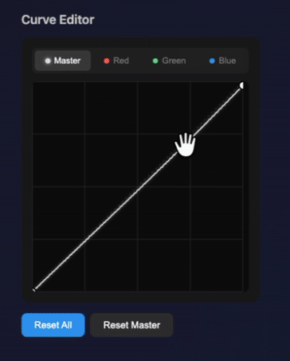
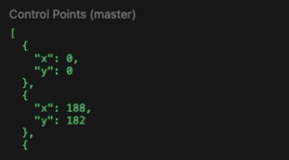

# RGB Curve

A fast, lightweight RGB curve editor component for React — like the curves tool in Adobe Lightroom, Premiere Pro, and Photoshop.







# > 🚀 **[Live Demo](https://pg8j5k.csb.app/)** — Try it out in your browser!

## Features

- 4 channels: **Master** (RGB), **Red**, **Green**, **Blue**
- Smooth cubic spline interpolation
- Returns **control points** + **256-value LUT** for pixel processing
- Beautiful dark theme UI (Lightroom/Premiere Pro inspired)
- Fully customizable via JSON style props
- TypeScript support
- Zero dependencies (only React as peer dep)
- Lightweight: ~6KB gzipped

## Installation

```bash
npm install rgb-curve
```

```bash
yarn add rgb-curve
```

```bash
pnpm add rgb-curve
```

## Quick Start

```tsx
import { RGBCurve } from 'rgb-curve';

function App() {
  return (
    <RGBCurve
      onChange={({ points, lut, activeChannel }) => {
        console.log('Control points:', points);
        console.log('LUT:', lut);
        console.log('Active channel:', activeChannel);
      }}
    />
  );
}
```

## How to Use

| Action | Description |
|--------|-------------|
| **Click** on curve | Add a new control point |
| **Drag** a point | Adjust the curve |
| **Double-click** a point | Remove the point |
| **Click tabs** | Switch between Master/R/G/B channels |

## Props

| Prop | Type | Default | Description |
|------|------|---------|-------------|
| `width` | `number` | `300` | Width of the curve editor in pixels |
| `height` | `number` | `300` | Height of the curve editor in pixels |
| `defaultPoints` | `Partial<ChannelPoints>` | — | Initial control points for each channel |
| `points` | `Partial<ChannelPoints>` | — | Controlled points (makes component controlled) |
| `defaultChannel` | `Channel` | `'master'` | Initial active channel |
| `activeChannel` | `Channel` | — | Controlled active channel |
| `onChange` | `(data: CurveChangeData) => void` | — | Callback when curve changes |
| `onChannelChange` | `(channel: Channel) => void` | — | Callback when channel changes |
| `styles` | `RGBCurveStyles` | — | Custom styles (see Styling section) |
| `showTabs` | `boolean` | `true` | Show/hide channel tabs |
| `showHistogram` | `boolean` | `false` | Show/hide histogram overlay |
| `histogramData` | `Uint8Array` | — | Histogram data (256 values) |
| `disabled` | `boolean` | `false` | Disable all interactions |
| `className` | `string` | — | CSS class for container |
| `interpolation` | `'monotone' \| 'catmullRom'` | `'monotone'` | Curve interpolation type |

## onChange Data

The `onChange` callback receives an object with:

```ts
interface CurveChangeData {
  // Control points for all channels
  points: {
    master: CurvePoint[];
    red: CurvePoint[];
    green: CurvePoint[];
    blue: CurvePoint[];
  };

  // Look-Up Table (256 values per channel) for pixel processing
  lut: {
    master: Uint8Array;
    red: Uint8Array;
    green: Uint8Array;
    blue: Uint8Array;
  };

  // Currently active channel
  activeChannel: 'master' | 'red' | 'green' | 'blue';
}

interface CurvePoint {
  x: number; // 0-255
  y: number; // 0-255
}
```

## Ref Methods

You can access component methods via ref:

```tsx
import { useRef } from 'react';
import { RGBCurve, RGBCurveRef } from 'rgb-curve';

function App() {
  const curveRef = useRef<RGBCurveRef>(null);

  return (
    <>
      <RGBCurve ref={curveRef} />

      <button onClick={() => curveRef.current?.reset()}>
        Reset All
      </button>

      <button onClick={() => curveRef.current?.resetChannel('red')}>
        Reset Red
      </button>

      <button onClick={() => {
        const lut = curveRef.current?.getLUT();
        console.log(lut);
      }}>
        Get LUT
      </button>
    </>
  );
}
```

### Available Methods

| Method | Description |
|--------|-------------|
| `reset()` | Reset all channels to default (diagonal line) |
| `resetChannel(channel)` | Reset a specific channel |
| `getLUT()` | Get current LUT data |
| `getPoints()` | Get current control points |
| `setPoints(points)` | Set points programmatically |

---

## Styling

The component comes with a beautiful dark theme by default. You can customize every aspect using the `styles` prop.

### Complete Styles Example

```tsx
<RGBCurve
  styles={{
    // Container wrapper
    container: {
      background: '#1a1a1a',
      borderRadius: 12,
      padding: 16,
    },

    // Canvas wrapper
    canvasWrapper: {
      borderRadius: 8,
      overflow: 'hidden',
      background: '#0d0d0d',
    },

    // Grid lines
    grid: {
      color: '#2a2a2a',
      lineWidth: 1,
      subdivisions: 4,
      showDiagonal: true,
      diagonalColor: '#333333',
    },

    // Curve lines (per channel)
    curve: {
      master: {
        color: '#e0e0e0',
        width: 2,
        shadowColor: 'rgba(255, 255, 255, 0.3)',
        shadowBlur: 4,
      },
      red: {
        color: '#ff6b6b',
        width: 2,
        shadowColor: 'rgba(255, 107, 107, 0.4)',
        shadowBlur: 4,
      },
      green: {
        color: '#51cf66',
        width: 2,
        shadowColor: 'rgba(81, 207, 102, 0.4)',
        shadowBlur: 4,
      },
      blue: {
        color: '#339af0',
        width: 2,
        shadowColor: 'rgba(51, 154, 240, 0.4)',
        shadowBlur: 4,
      },
    },

    // Control points
    controlPoint: {
      radius: 6,
      fill: '#ffffff',
      stroke: '#000000',
      strokeWidth: 2,
      activeFill: '#ffd43b',
      activeStroke: '#000000',
      hoverScale: 1.2,
    },

    // Channel tabs
    tabs: {
      background: '#252525',
      borderRadius: 8,
      gap: 4,
      tab: {
        padding: '8px 16px',
        borderRadius: 6,
        fontSize: 13,
        fontWeight: 500,
        color: '#808080',
        background: 'transparent',
        hoverBackground: '#333333',
        activeColor: '#ffffff',
        activeBackground: '#404040',
      },
    },

    // Histogram (if enabled)
    histogram: {
      show: true,
      opacity: 0.3,
      fillColor: '#666666',
    },
  }}
/>
```

---

## Style Reference

### Container Style

```ts
container: CSSProperties
```

Standard React CSS properties for the outer container.

```tsx
styles={{
  container: {
    background: 'linear-gradient(135deg, #1a1a2e, #16213e)',
    borderRadius: 16,
    padding: 20,
    boxShadow: '0 10px 40px rgba(0,0,0,0.5)',
  }
}}
```

### Canvas Wrapper Style

```ts
canvasWrapper: CSSProperties
```

Standard React CSS properties for the canvas container.

```tsx
styles={{
  canvasWrapper: {
    borderRadius: 12,
    border: '1px solid #333',
    overflow: 'hidden',
  }
}}
```

### Grid Style

```ts
interface GridStyle {
  color?: string;        // Grid line color
  lineWidth?: number;    // Grid line width
  subdivisions?: number; // Number of grid divisions (default: 4)
  showDiagonal?: boolean; // Show diagonal baseline
  diagonalColor?: string; // Diagonal line color
}
```

```tsx
styles={{
  grid: {
    color: '#333333',
    lineWidth: 1,
    subdivisions: 4,
    showDiagonal: true,
    diagonalColor: '#444444',
  }
}}
```

### Curve Style

```ts
interface CurveLineStyle {
  color?: string;       // Curve line color
  width?: number;       // Curve line width
  shadowColor?: string; // Glow effect color
  shadowBlur?: number;  // Glow blur radius
}
```

```tsx
styles={{
  curve: {
    master: { color: '#ffffff', width: 2 },
    red: { color: '#ff0000', width: 2, shadowColor: 'rgba(255,0,0,0.5)', shadowBlur: 8 },
    green: { color: '#00ff00', width: 2 },
    blue: { color: '#0088ff', width: 3 },
  }
}}
```

### Control Point Style

```ts
interface ControlPointStyle {
  radius?: number;       // Point radius
  fill?: string;         // Point fill color
  stroke?: string;       // Point border color
  strokeWidth?: number;  // Point border width
  activeFill?: string;   // Fill when dragging
  activeStroke?: string; // Border when dragging
  hoverScale?: number;   // Scale on hover (1.2 = 120%)
}
```

```tsx
styles={{
  controlPoint: {
    radius: 8,
    fill: '#ffffff',
    stroke: '#000000',
    strokeWidth: 2,
    activeFill: '#ffcc00',
    activeStroke: '#000000',
    hoverScale: 1.3,
  }
}}
```

### Tabs Style

```ts
interface TabsStyle {
  background?: string;    // Tabs container background
  borderRadius?: number;  // Tabs container border radius
  gap?: number;           // Gap between tabs
  tab?: {
    padding?: string;
    borderRadius?: number;
    fontSize?: number;
    fontWeight?: number | string;
    color?: string;           // Inactive tab text color
    background?: string;      // Inactive tab background
    hoverBackground?: string; // Hover background
    activeColor?: string;     // Active tab text color
    activeBackground?: string; // Active tab background
  };
}
```

```tsx
styles={{
  tabs: {
    background: '#1a1a1a',
    borderRadius: 10,
    gap: 8,
    tab: {
      padding: '10px 20px',
      borderRadius: 8,
      fontSize: 14,
      fontWeight: 600,
      color: '#666666',
      background: 'transparent',
      hoverBackground: '#2a2a2a',
      activeColor: '#ffffff',
      activeBackground: '#3a3a3a',
    },
  }
}}
```

### Histogram Style

```ts
interface HistogramStyle {
  show?: boolean;     // Show/hide histogram
  opacity?: number;   // Histogram opacity (0-1)
  fillColor?: string; // Histogram bar color
}
```

```tsx
<RGBCurve
  showHistogram={true}
  histogramData={myHistogramData} // Uint8Array of 256 values
  styles={{
    histogram: {
      opacity: 0.4,
      fillColor: '#888888',
    }
  }}
/>
```

---

## Theme Examples

### Light Theme

```tsx
<RGBCurve
  styles={{
    container: {
      background: '#f5f5f5',
      borderRadius: 12,
      padding: 16,
    },
    canvasWrapper: {
      background: '#ffffff',
      borderRadius: 8,
      border: '1px solid #e0e0e0',
    },
    grid: {
      color: '#e0e0e0',
      diagonalColor: '#d0d0d0',
    },
    curve: {
      master: { color: '#333333', width: 2 },
      red: { color: '#e53935', width: 2 },
      green: { color: '#43a047', width: 2 },
      blue: { color: '#1e88e5', width: 2 },
    },
    controlPoint: {
      fill: '#ffffff',
      stroke: '#333333',
      activeFill: '#ffca28',
    },
    tabs: {
      background: '#e0e0e0',
      tab: {
        color: '#666666',
        activeColor: '#000000',
        activeBackground: '#ffffff',
        hoverBackground: '#eeeeee',
      },
    },
  }}
/>
```

### Neon Theme

```tsx
<RGBCurve
  styles={{
    container: {
      background: '#0a0a0a',
      borderRadius: 16,
      padding: 20,
      border: '1px solid #333',
    },
    canvasWrapper: {
      background: '#000000',
      borderRadius: 12,
    },
    grid: {
      color: '#1a1a1a',
      diagonalColor: '#2a2a2a',
    },
    curve: {
      master: {
        color: '#00ffff',
        width: 2,
        shadowColor: '#00ffff',
        shadowBlur: 10
      },
      red: {
        color: '#ff0066',
        width: 2,
        shadowColor: '#ff0066',
        shadowBlur: 10
      },
      green: {
        color: '#00ff66',
        width: 2,
        shadowColor: '#00ff66',
        shadowBlur: 10
      },
      blue: {
        color: '#0066ff',
        width: 2,
        shadowColor: '#0066ff',
        shadowBlur: 10
      },
    },
    controlPoint: {
      radius: 5,
      fill: '#ffffff',
      stroke: '#00ffff',
      strokeWidth: 2,
      activeFill: '#ff00ff',
      hoverScale: 1.4,
    },
    tabs: {
      background: '#111111',
      tab: {
        color: '#666666',
        activeColor: '#00ffff',
        activeBackground: '#1a1a1a',
        hoverBackground: '#1a1a1a',
      },
    },
  }}
/>
```

### Minimal Theme

```tsx
<RGBCurve
  styles={{
    container: {
      background: 'transparent',
      padding: 0,
    },
    canvasWrapper: {
      background: '#1a1a1a',
      borderRadius: 4,
    },
    grid: {
      color: '#252525',
      showDiagonal: false,
      subdivisions: 2,
    },
    curve: {
      master: { color: '#888', width: 1.5, shadowBlur: 0 },
      red: { color: '#f66', width: 1.5, shadowBlur: 0 },
      green: { color: '#6f6', width: 1.5, shadowBlur: 0 },
      blue: { color: '#66f', width: 1.5, shadowBlur: 0 },
    },
    controlPoint: {
      radius: 4,
      fill: '#fff',
      stroke: 'transparent',
      strokeWidth: 0,
      hoverScale: 1.5,
    },
    tabs: {
      background: 'transparent',
      gap: 8,
      tab: {
        padding: '6px 12px',
        background: 'transparent',
        hoverBackground: '#252525',
        activeBackground: '#333',
      },
    },
  }}
/>
```

---

## Applying LUT to Images

The LUT (Look-Up Table) returned by `onChange` can be used for fast pixel processing:

```tsx
import { RGBCurve, applyLUT, LUTData } from 'rgb-curve';

function ImageEditor() {
  const canvasRef = useRef<HTMLCanvasElement>(null);
  const originalImageData = useRef<ImageData | null>(null);

  const handleCurveChange = ({ lut }: { lut: LUTData }) => {
    const canvas = canvasRef.current;
    if (!canvas || !originalImageData.current) return;

    const ctx = canvas.getContext('2d');
    if (!ctx) return;

    // Clone original data
    const imageData = new ImageData(
      new Uint8ClampedArray(originalImageData.current.data),
      originalImageData.current.width,
      originalImageData.current.height
    );

    // Apply LUT to each pixel
    const data = imageData.data;
    for (let i = 0; i < data.length; i += 4) {
      const [r, g, b] = applyLUT(data[i], data[i + 1], data[i + 2], lut);
      data[i] = r;
      data[i + 1] = g;
      data[i + 2] = b;
    }

    ctx.putImageData(imageData, 0, 0);
  };

  return (
    <div>
      <RGBCurve onChange={handleCurveChange} />
      <canvas ref={canvasRef} />
    </div>
  );
}
```

---

## Utility Exports

The package exports several utilities for advanced use cases:

```tsx
import {
  // Components
  RGBCurve,
  CurveCanvas,
  ChannelTabs,

  // Hooks
  useCurvePoints,
  useCanvasInteraction,

  // Utilities
  generateLUT,
  generateChannelLUT,
  applyLUT,
  getDefaultPoints,
  getDefaultChannelPoints,
  monotoneCubicInterpolation,
  catmullRomInterpolation,
  sortPoints,
  clamp,

  // Constants
  CHANNELS,
  CHANNEL_INFO,
  CHANNEL_COLORS,
  DEFAULT_STYLES,
  DEFAULT_WIDTH,
  DEFAULT_HEIGHT,

  // Types
  type CurvePoint,
  type Channel,
  type ChannelPoints,
  type LUTData,
  type CurveChangeData,
  type RGBCurveProps,
  type RGBCurveRef,
  type RGBCurveStyles,
} from 'rgb-curve';
```

---

## TypeScript

Full TypeScript support is included. Import types as needed:

```tsx
import type {
  CurvePoint,
  Channel,
  ChannelPoints,
  LUTData,
  CurveChangeData,
  RGBCurveProps,
  RGBCurveRef,
  RGBCurveStyles,
  CurveLineStyle,
  ControlPointStyle,
  GridStyle,
  TabsStyle,
  HistogramStyle,
} from 'rgb-curve';
```

---

## Browser Support

- Chrome (latest)
- Firefox (latest)
- Safari (latest)
- Edge (latest)

Requires browsers with Canvas 2D support.

---

## License

MIT

---

## Contributing

Contributions are welcome! Please open an issue or submit a PR.
